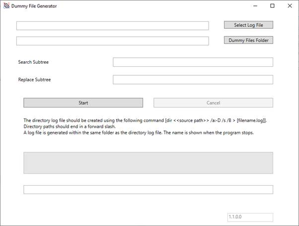
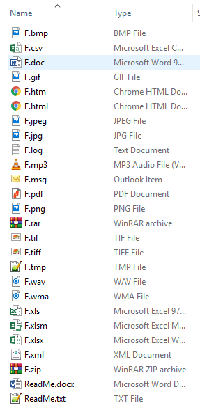
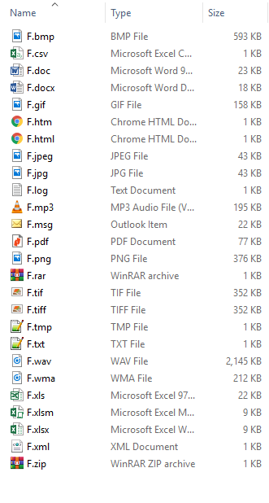
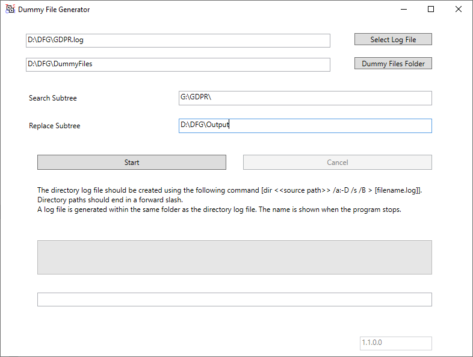
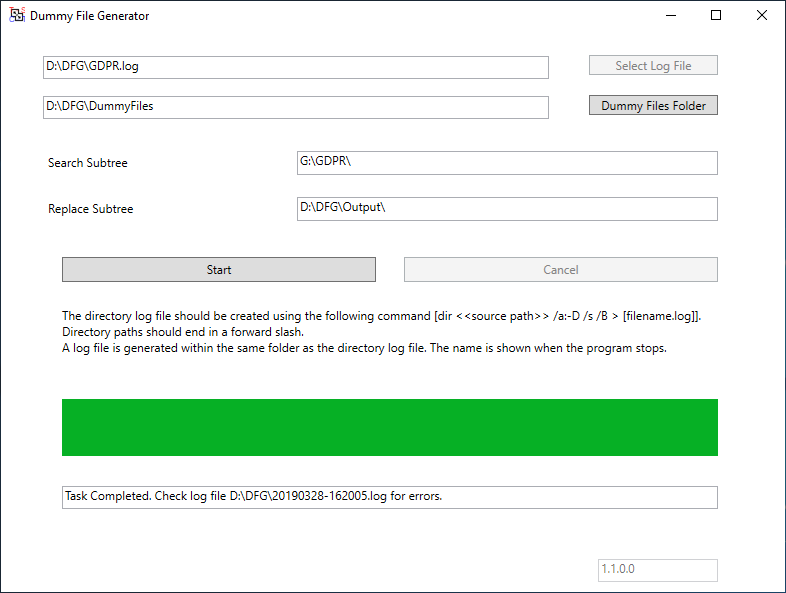
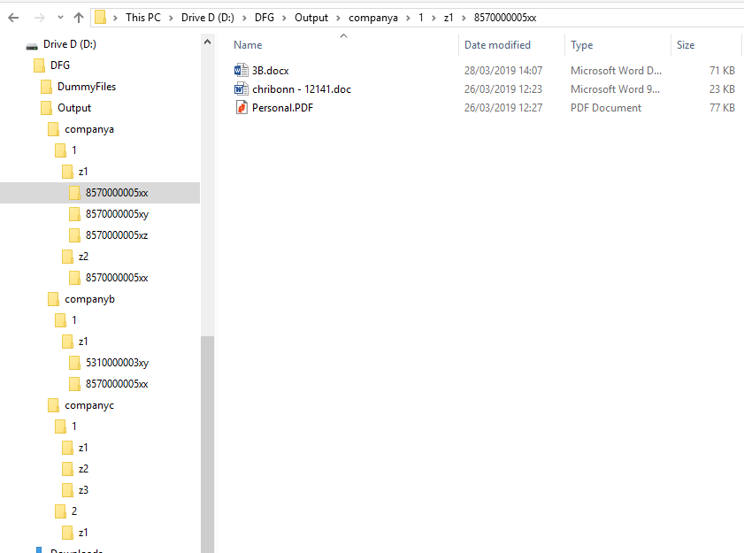

# Dummy File Generator (DFG) Documentation and Case Example

## Preamble

This solution is published under the GNU General Public License v2.0 as at 20190326\.

## Dummy File Generator v2

Dummy File Generator (DFG) is a program that allows you to replicate a directory structure containing sensitive files but replacing the sensitive files with dummy files of your choice.

The purpose of DFG is to cater for those situations in which you are working with a vendor or on a development team (pre-production) and prefer to (or have a requirement to) have dummy files being handed over rather than sensitive files.

You may be prohibited from providing actual files because the files contain sensitive data such as GDPR, or top-secret documents. Experimenting with (or distributing) actual files may be illegal or against organizational policy. Pen drives have been forgotten on trains!!!!

With DFG you can provide third parties with an exact replica of the sensitive directory (respecting file names, etc) but replacing with actual data with DUMMY data.

You control what file extensions are processed and the dummy data that will be used.

When the program finishes, a log file will give you a list of skipped extensions (you did not provide an equivalent dummy file) and problems encountered.

## Inputs and Outputs

**Select Log File:** Here you provide a text file with a list of directories to be replicated.  On the source machine you can easily generate this list using the command _dir [source path] /a-D /s /B > [filename.log]_. 

This approach allows the log file to be edited before being provided to the vendor.  It also caters for an asynchronous setup in which a vendor would have DFG without the need to install the program on the client computers.

**Dummy Files Folder**: This is a directory that will hold the dummy files you want to generate. The name of the file is irrelevant. DFG only caters for one of each file type. A starter kit of dummy files is available for download from here.

**Search Subtree** and **Replace Subtree** allow you to change the directory path of the source computer (generated when you issued the DIR command) to where the dummy files are to be created on the target computer.

# Case Study

An organization has a folder containing sensitive documentation on a server in a folder called GDPR.  This folder contains sensitive documentation.  The company would like to provide a replica of the folder structure and files to a vendor to perform load and functional testing on a solution. The company do not want to hand over original files for security and compliance reasons.

1. The SA executes the command DIR G:\GDPR /a:-D /B /S > C:\GDPR.LOG” to generate a log file of the directories.

Below are the first few lines of the log file

G:\GDPR\CompanyA\1\Z1\8570000005XX\3B.docx  
G:\GDPR\CompanyA\1\Z1\8570000005XY\12141 chribonn.pdf  
G:\GDPR\CompanyA\1\Z1\8570000005XY\12141.wav  
G:\GDPR\CompanyA\1\Z1\8570000005XZ\Abstract.spe  
G:\GDPR\CompanyA\1\Z1\8570000005XZ\Complaints Sheet.doc  
G:\GDPR\CompanyA\1\Z1\8570000005XX\chribonn - 12141.doc  
G:\GDPR\CompanyA\1\Z1\8570000005XX\Personal.PDF  
G:\GDPR\CompanyA\1\Z2\8570000005XX\Complaint\12141 chribonn.msg  
G:\GDPR\CompanyA\1\Z2\8570000005XX\Complaint\Complaints Sheet.doc G:\GDPR\CompanyB\1\Z1\8570000005XX\Complaint\chribonn2 - 141.doc  
G:\GDPR\CompanyB\1\Z1\8570000005XX\Complaint\Legal Answer.pdf  
G:\GDPR\CompanyB\1\Z1\5310000003XY\20150915_DCL.doc  
G:\GDPR\CompanyB\1\Z1\5310000003XY\20150915_DCL.pdf  
G:\GDPR\CompanyC\1\Z1\5310000003YY\20140915_DCL.pdf  
G:\GDPR\CompanyC\1\Z2\5310000003YY\20140915_MED.pdf  
G:\GDPR\CompanyC\1\Z3\728000539ACB\DOC B.TXT  
G:\GDPR\CompanyC\1\Z1\728000539ACB\DOC B1.PNG  
G:\GDPR\CompanyC\2\Z1\728000539ACB\DOC B2.PNG  
G:\GDPR\CompanyC\2\Z1\728000539ACB\DOC B3.JPG

 

2.      The log file is transmitted to a computer on which DFG is installed. Besides the program itself, a directory called Dummy Files contains the dummy files that will be generated instead of the original files.

The actual file name of the dummy files is irrelevant. DFG will only copy a file if there is a match on the extension - this allows certain file types to be skipped.

The files within the folder can be files that are readable by the application that created them or they can be BLOBs (Binary Large Objects). The former case may be necessary to ensure that the process on the files does not make the file unreadable (eg wrapping the file in a secure wrapper). The latter case could be applied if the test is purely on load testing the application. The size of the files can be varied to cater for situations in which it is necessary to test functions that are impacted by the size of the files.

3\. On the vendor computer the directory that will contain the dummy files will be on D:\DFG\Output. Therefore G:\GDPR\ paths will be replaced by D:\DFG\Output\.

4\. After pressing the start button, the file is processed. Upon completion the status line gives the location of the error log file related to this run. In this case it is D:\DFG\20190328-162005.log. It is created in the same directory as the log file.

D:\DFG\20190328-162005.log contains the following text: Line 4: File extension .spe not catered for This indicates that the file on line 4 Abstract.spe was not generated because a dummy file with the same extension was not found. This could have been intentional or a dummy file needs to be added to the files in the Dummy Files folder.

5\. In the folder D:\DFG\Output one should find the directory structure with the dummy files.

Feedback and further development

The source code of this solution are available on

